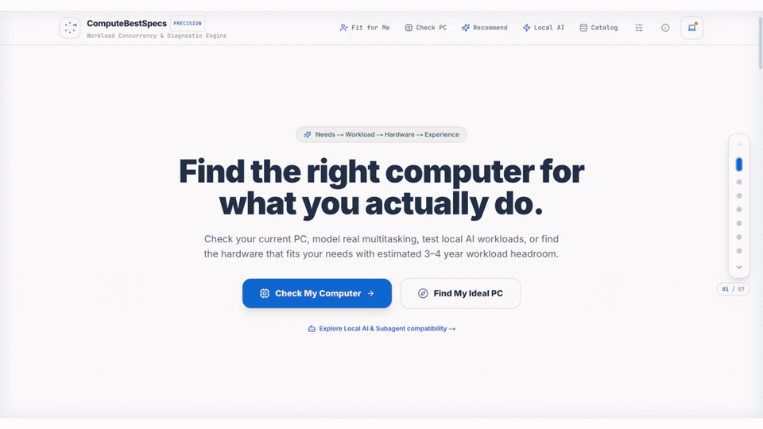
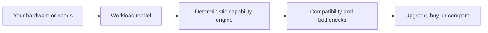
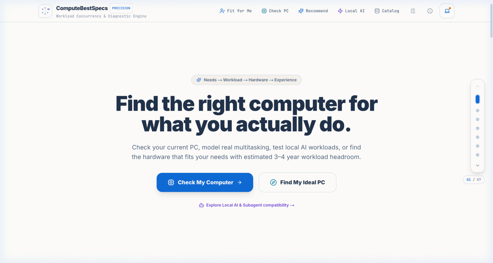
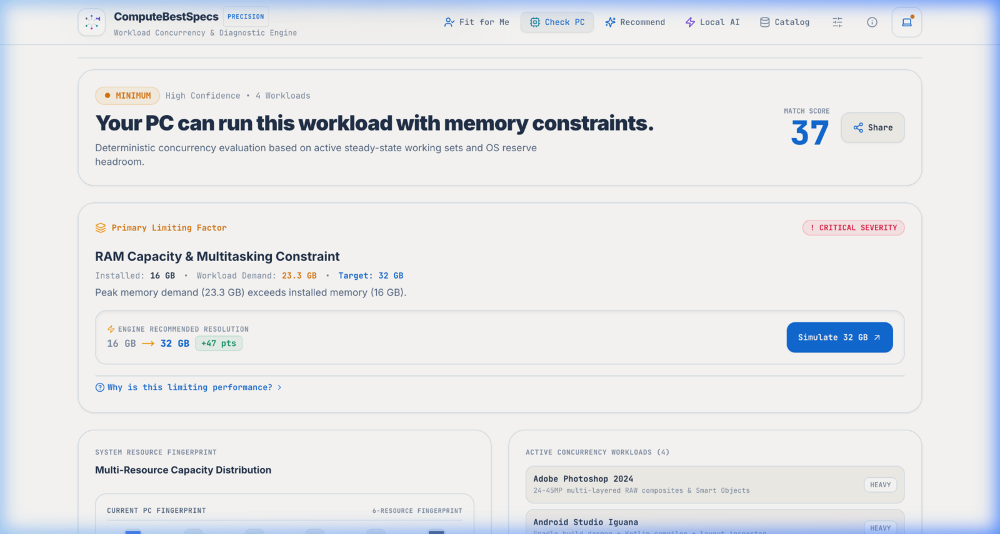
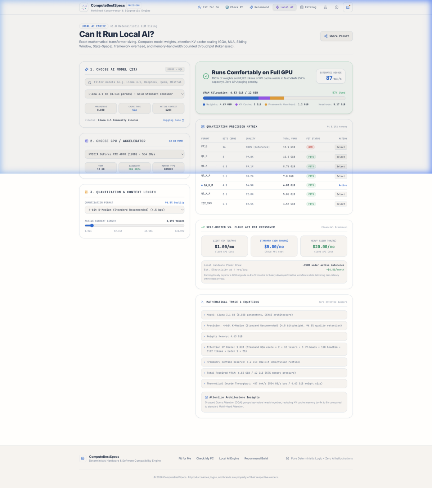

<div align="center">

# ComputeBestSpecs

### Find the right computer for what you actually do.

Deterministic PC compatibility, multi-app workload modeling, upgrade simulation,
hardware recommendations, and local-AI sizing—built around explainable results.

[](https://nextjs.org/)
[](https://www.typescriptlang.org/)
[](https://www.prisma.io/)
[](https://vitest.dev/)
[](#project-status)

[Quick start](#quick-start) · [Product flows](#product-flows) · [Architecture](#architecture) · [Trust model](#trust-model)

<br />

<a href="docs/assets/readme/product-tour.mp4">
  
</a>

<sub>▶ Click the preview to open the MP4 product tour.</sub>

</div>

---

## Why ComputeBestSpecs?

Traditional requirement checkers evaluate one application at a time and reduce a
computer to a few minimum numbers. Real workloads are concurrent: an IDE, browser,
containers, emulators, creative tools, and local AI may all compete for memory and
compute at once.

ComputeBestSpecs models that combined workload and answers practical questions:

- Can this computer run my actual mix of applications and games?
- What is the primary bottleneck?
- Which upgrade creates the largest improvement?
- What hardware should I buy for the next several years?
- Which model, quantization, and context size fit in local GPU memory?
- How do as many as three computers compare under the same workload?

The scoring path is deterministic. AI-style input helpers may assist with parsing or
explanation, but they do not author compatibility scores.

## Product flows

| Goal | Route | What the user does | What the product returns |
|---|---|---|---|
| Check an existing PC | `/check` | Enter hardware, choose applications, and select concurrent or isolated usage | Match score, limiting component, resource pressure, upgrade simulation, evidence, and a shareable result |
| Find a computer | `/recommend` | Choose or describe a workload, then set form factor, OS, budget, and longevity | Minimum, balanced, and high-headroom target specifications with trade-offs |
| Size local AI | `/ai` | Select a model, accelerator, quantization, batch size, and context length | VRAM allocation, fit status, estimated throughput, precision alternatives, and local-versus-cloud estimates |
| Compare systems | `/compare` | Save up to three evaluated systems in the browser | A side-by-side matrix recalculated against one shared workload |
| Explore requirements | `/software` | Browse and filter the software catalog | Platform support, minimum and recommended requirements, workloads, provenance, and freshness metadata |
| Evaluate personal fit | `/fit` | Describe needs and select target hardware | Capability fit, execution strategy, limitations, and experience-oriented guidance |



## Interface

### Start from the decision—not from a wall of specifications



### See the verdict, limiting factor, and next action first



### Inspect the math behind local inference



## Current catalog coverage

The canonical in-repository catalogs currently contain:

| Catalog | Entries |
|---|---:|
| Software and game profiles | 30 |
| CPUs | 29 |
| GPUs | 32 |
| Open-weight AI models | 23 |
| AI accelerators | 24 |

Coverage includes creative applications, development tools, IDEs, browsers,
virtualization, 3D and game engines, CAD/engineering tools, games, audio,
streaming, productivity, and local-AI runtimes.

Catalog entries can carry source records, retrieval dates, confidence states,
platform support, workload profiles, and versioned requirements. Missing data
should remain unknown rather than becoming a fabricated requirement.

## Core capabilities

- Multi-application concurrency and OS-reserve modeling
- CPU, GPU, RAM, VRAM, storage, architecture, API, and virtualization checks
- Bottleneck-aware scoring with structured diagnostic codes
- Counterfactual RAM, GPU, CPU, and storage upgrade simulation
- Three-tier hardware recommendation generation
- Local LLM weight, KV-cache, runtime-overhead, and bandwidth calculations
- Quantization comparison from FP16 through low-bit formats
- Anonymous browser-local comparison for up to three systems
- Immutable public result snapshots with engine and catalog version metadata
- Hardware and software normalization with ambiguity states
- Privacy-aware analytics, error reporting, consent, and payload redaction
- Dataset-health metrics, ingestion staging, promotion gates, and golden tests

## Architecture

```text
app/                         Next.js routes and API handlers
components/                  Product UI, navigation, results, comparison, consent
features/                    Feature-oriented selectors and recommendation cards
lib/domain/                  Canonical hardware, software, evaluation, and provenance types
lib/engine/                  Deterministic evaluation, rules, confidence, trace, and recommendations
lib/data/                    Canonical hardware and software catalogs
lib/ai/                      AI model catalog and local-inference sizing math
lib/comparison/              Versioned browser-local comparison storage and analysis
lib/observability/           Analytics, consent, logging, redaction, and error reporting
services/                    Normalization, ingestion, recommendations, sharing, and background jobs
prisma/                      Database schema and seed data
tests/unit/                  Domain, engine, security, privacy, and service tests
tests/golden/                Golden scenarios and combinatorial regression corpus
```

The project uses a shared deterministic domain engine from both client-facing
experiences and API routes. Runtime boundaries are validated with Zod, while Prisma
provides the persisted catalog and immutable evaluation snapshots.

## Trust model

ComputeBestSpecs is designed around several invariants:

1. **Missing is not a default.** Unknown, ambiguous, stale, and conflicting data are distinct states.
2. **Results come from code.** Compatibility and recommendations are calculated by deterministic rules.
3. **Better hardware must not score worse.** Monotonicity and property tests protect upgrade behavior.
4. **Evidence stays attached.** Results can include sources, catalog revisions, engine versions, and calculation traces.
5. **Untrusted input is validated.** API payloads and persisted browser data cross runtime schemas.
6. **Private comparisons stay local.** Saved comparison profiles use browser storage and are capped at three systems.
7. **Telemetry excludes raw specifications.** Analytics and errors pass through typed facades and redaction.

Real-world performance can still vary with cooling, power limits, drivers, firmware,
background activity, and project-specific behavior. Results are decision support—not
a substitute for device-specific benchmarks.

## Quick start

### Prerequisites

- Node.js 20 or newer
- npm

### Local development

```bash
git clone https://github.com/kateLint/computebestspecs.git
cd computebestspecs

npm install
cp .env.example .env

npm run prisma:generate
npm run prisma:db:push
npm run prisma:seed
npm run dev
```

Open [http://localhost:3000](http://localhost:3000).

### Verification

```bash
npm run typecheck
npm test
npm run build
```

Database-backed tests require `DATABASE_URL` and an initialized schema.

## API surface

| Method | Endpoint | Purpose |
|---|---|---|
| `POST` | `/api/compatibility/evaluate` | Evaluate hardware against selected workloads and persist a result snapshot |
| `POST` | `/api/recommendations` | Generate workload-driven target specifications |
| `GET` | `/api/hardware/search` | Search normalized CPU or GPU records |
| `GET` | `/api/software/search` | Search software and workload profiles |
| `GET` | `/api/results/{publicId}` | Retrieve a public immutable evaluation snapshot |
| `GET` | `/api/health` | Check application and database health |
| `GET` | `/api/admin/metrics` | Read dataset and evaluation health metrics |

## Docker

```bash
docker compose up --build
```

The application is exposed on `http://localhost:3000`.

## Documentation

- [Workflow and user journeys](docs/WORKFLOW_AND_USER_JOURNEYS.md)
- [Engineering roadmap](docs/ENGINEERING_ROADMAP.md)
- [Privacy and data inventory](docs/PRIVACY_AND_DATA_INVENTORY.md)
- [Production observability guide](docs/PRODUCTION_OBSERVABILITY_GUIDE.md)
- [Monetization and affiliate foundation](docs/MONETIZATION_AND_AFFILIATE_FOUNDATION.md)

## Project status

ComputeBestSpecs is under active development. The deterministic engine, primary
product routes, local comparison, catalogs, observability foundation, and automated
test corpus are implemented. Before a public production launch, complete the release
gates for reproducible installs, CI, linting, dependency security, end-to-end browser
testing, catalog verification, accessibility, and real-device calibration.

Contributions and issue reports are welcome. Please include reproducible input,
expected behavior, actual behavior, and—when reporting a compatibility result—the
engine and catalog versions shown in the result.
