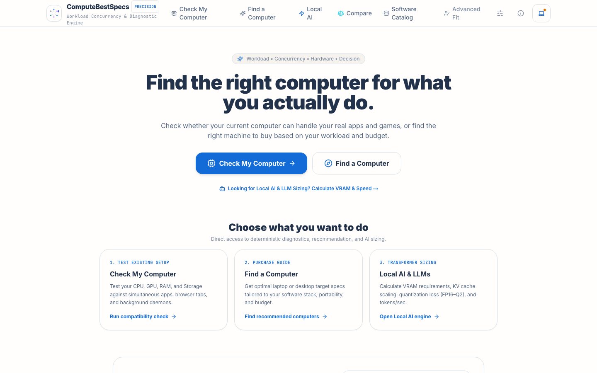
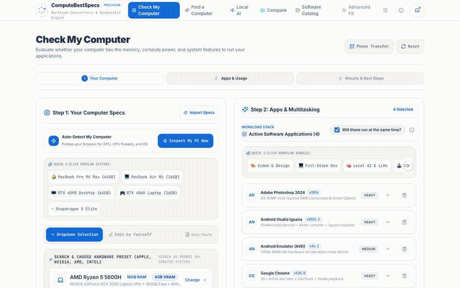
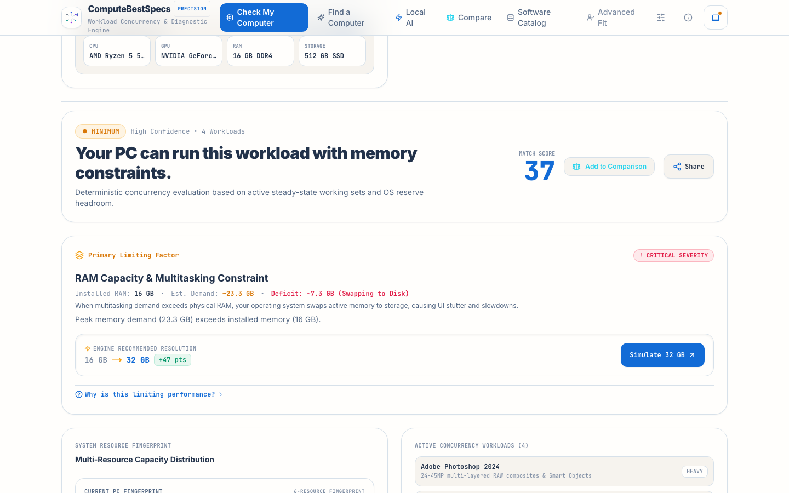
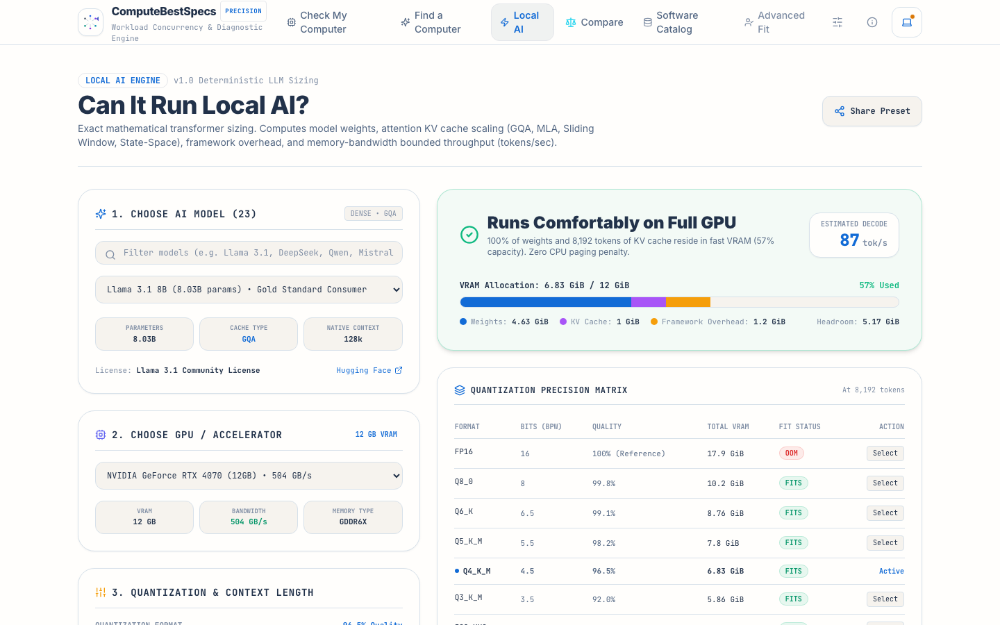

# ComputeBestSpecs — Workload Compatibility & Spec Recommendation Platform


A production-ready web application and deterministic compatibility engine that performs bidirectional evaluation between PC hardware and multi-application software workflows.



---

## See it in action

Fill in a hardware profile, pick the apps you actually run at the same time, and get a bottleneck-aware compatibility score — not a naive `RAM >= minRam` check.



<table>
<tr>
<td width="50%">

**Bottleneck detection, not just pass/fail**

Pinpoints the exact limiting resource (here: RAM under concurrent multitasking), the deficit, and the specific upgrade that clears it.



</td>
<td width="50%">

**Local AI & LLM sizing**

Exact transformer math: model weights, KV cache scaling (GQA/MLA/sliding window), quantization tradeoffs, and estimated tokens/sec — per GPU.



</td>
</tr>
</table>

---

## 1. Project Purpose & Architecture

Traditional system requirements checkers rely on naive comparisons like `userRam >= minRam` and evaluate applications in isolation. In reality, modern users multitask between IDEs, emulators, browsers, design tools, and local servers simultaneously.

**ComputeBestSpecs** operates as a **Workload Compatibility & Spec Engine**:
- **Mode A (I have a computer):** Evaluates whether an existing PC profile (CPU, GPU, RAM, Storage, OS) can handle a simultaneous software stack, pinpointing bottlenecks and recommending high-impact upgrades.
- **Mode B (I know which software I need):** Computes combined concurrent memory, CPU throughput, and VRAM demands to construct 3 tailored hardware tiers: *Minimum*, *Recommended*, and *Professional / Ideal*.

### Key Design Principles
1. **Deterministic Logic:** Scoring and recommendations are 100% mathematical and source-backed. No LLMs are in the critical scoring path.
2. **Workload Concurrency Model:** Accounts for foreground ($1.0$), background ($0.65$), and occasional ($0.35$) weights, quantity of virtual devices/containers, OS reserve ($2.0-2.5\text{GB}$), background process buffer ($1.5\text{GB}$), and $15\%$ safety headroom.
3. **Bottleneck-Aware Scoring ($0-100$):** Critical component deficiencies (such as memory pressure or missing CUDA/VRAM) apply progressive penalties rather than being masked by high CPU scores.
4. **Result Permanence:** Every evaluated setup generates an immutable snapshot with `engineVersion` and `dataRevision` on shareable permalinks (`/results/{publicId}`).
5. **Data Provenance:** Requirements are verified against official vendor documentation, with confidence levels transparently displayed.

---

## 2. Tech Stack

- **Framework:** Next.js 14 (App Router)
- **Language:** TypeScript (Strict mode)
- **Database & ORM:** Prisma with PostgreSQL (same engine locally, via Docker, and in production)
- **Validation:** Zod schemas
- **Styling:** Tailwind CSS with modern dark mode and glassmorphism
- **Testing:** Vitest unit & integration test suites
- **Icons:** Lucide React

---

## 3. Quickstart & Local Setup

### Prerequisites
- Node.js 18+ (tested on Node 20 / 24)
- npm or yarn

### Installation
```bash
# 1. Clone & install dependencies
npm install

# 2. Setup environment variables
cp .env.example .env

# 3. Start a local Postgres (matches .env.example's DATABASE_URL)
docker compose up -d db

# 4. Apply migrations & seed verified hardware/software catalog
npx prisma migrate deploy
npm run prisma:seed

# 5. Start development server
npm run dev
```
Open [http://localhost:3000](http://localhost:3000) in your browser.

---

## 4. Testing & Verification Commands

```bash
# Run unit & engine tests
npm test

# Run TypeScript typecheck
npm run typecheck

# Run production build
npm run build
```

---

## 5. Docker Deployment

```bash
# Build and launch with Docker Compose
docker compose up --build
```
The application will be accessible at `http://localhost:3000`.

---

## 6. API Endpoints

- `POST /api/compatibility/evaluate` — Evaluates PC against selected workloads; returns score, bottlenecks, upgrades, and public snapshot ID. Rate limited (20/min/IP).
- `POST /api/recommendations` — Generates 3-tier hardware recommendations for selected applications. Rate limited (20/min/IP).
- `GET /api/hardware/search?type=cpu|gpu&q={query}` — Autocomplete search across hardware catalog. Rate limited (60/min/IP).
- `GET /api/software/search?q={query}` — Software catalog and workload profile retrieval. Rate limited (60/min/IP).
- `GET /api/results/{publicId}` — Retrieves immutable saved evaluation snapshot. Rate limited (60/min/IP).
- `GET /api/health` — System and database health status.
- `GET /api/admin/metrics` — Dataset quality & calibration metrics. Requires HTTP Basic Auth (`ADMIN_PASSWORD`).

---

## 7. Data Provenance & Confidence Policy

Software requirements are categorized by source:
1. **Official Vendor Documentation:** High confidence (e.g. Adobe Help, Google Android Studio Guide, Blender.org).
2. **Benchmark Providers & Release Notes:** High/Medium confidence.
3. **Manual / Development Fixtures:** Explicitly tagged as `TEST_DATA_ONLY` or `fixture`.

*Unverified / Manual Hardware:* If a user specifies custom hardware outside the catalog, the engine calculates estimates and transparently lowers confidence rating.

---

## 8. Legal

- [Terms of Service](https://computebestspecs.vercel.app/terms)
- [Privacy Policy](https://computebestspecs.vercel.app/privacy)
- [LICENSE](./LICENSE) — proprietary, all rights reserved.
