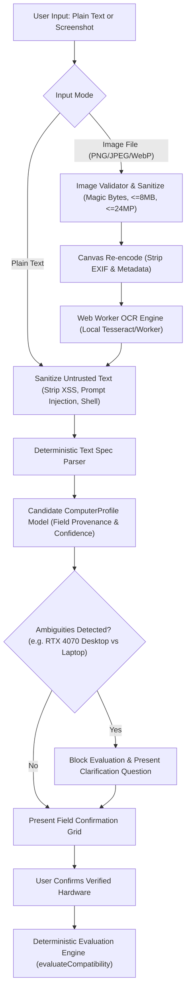

# Specification Import Architecture

## 1. Architectural Philosophy & Boundaries

Following the `no_human` core engineering principles:
- **Deterministic Evaluation Remains Authoritative**: The compatibility engine in `lib/engine/evaluate.ts` is the sole decider of compatibility scores, bottlenecks, upgrades, and local AI support.
- **Candidate Specification Role**: The in-browser parser and OCR extraction services only extract candidate fields and normalize hardware names. They **never** invent specifications, guess ambiguous hardware, or modify scores.
- **Human Confirmation Gate**: All extracted fields require user review and explicit resolution before being applied to the deterministic evaluation engine.

---

## 2. In-Browser Import Workflow

---

## 3. Data Flow & Provenance Tracking

Every extracted hardware component preserves structured provenance inside `ProfileFieldProvenance<T>`:
- `value`: Normalized representation (e.g. `AMD Ryzen 7 7800X3D`).
- `rawText`: Exact matched substring from the input source.
- `method`: `pasted_text`, `image_ocr`, `catalog_match`, or `manual`.
- `confidence`: Confidence rating between `0.0` and `1.0`.
- `state`: `confirmed`, `needs_confirmation`, `ambiguous`, `missing`, or `not_recognized`.
- `candidates`: List of alternative catalog matches when ambiguous.

Raw pasted text and full OCR transcripts are discarded after field extraction and never persisted to local storage or external analytics.
