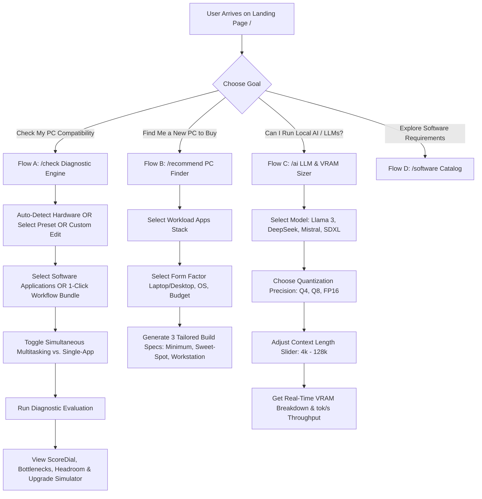

# ComputeBestSpecs — End-to-End Workflow & User Journeys Specification

## Executive Summary
**ComputeBestSpecs** is a deterministic, multi-app hardware compatibility and workload fit diagnostic platform. It eliminates guesswork when buying or upgrading computers for creative, software engineering, 3D modeling, local AI/LLM, and multitasking workflows.

---

## 1. System User Journeys & State Machines

---

## 2. Detailed Flow Specifications

### Flow A: Hardware & Multi-App Concurrency Diagnostic (`/check` & `/fit`)
1. **Hardware Configuration**:
   - **Auto-Detection (`⚡ Inspect My PC Now`)**: Probes WebGL renderer strings, physical CPU core concurrency, and OS architecture, automatically matching to verified presets (e.g. *MacBook Pro M4 Max 64GB* or *RTX 4090 Desktop*).
   - **1-Click Popular Hardware Presets**: Instant pills for MacBook Pro M4 Max, MacBook Air M4, RTX 4090 Desktop, RTX 4060 Laptop, Snapdragon X Elite.
   - **Dropdown / Searchable Catalog**: 40+ curated desktop and laptop configurations.
   - **Edit by Yourself (Custom Hardware)**: Direct control over CPU Cores/Architecture, GPU Model/VRAM/Features (CUDA, Metal, Vulkan), RAM (GB) & Type (DDR4/DDR5/Unified), Storage (GB/SSD), and OS Family/Version.
   - **Auto-Paste Specs**: Natural language text ingestion parsing raw spec sheets.

2. **Workload Stack Configuration**:
   - **1-Click Workflow Bundles**:
     - 🎨 *Video & Design*: Premiere Pro + After Effects + Photoshop + Chrome
     - 💻 *Full-Stack Dev*: VS Code + Docker Desktop + Android Studio + Chrome
     - 🧠 *Local AI & LLMs*: Ollama + ComfyUI Stable Diffusion + VS Code + Docker
     - 🕹️ *3D & Game Engine*: Blender 4 + Unreal Engine 5.4 + Photoshop
     - 🏢 *Office & Multitask*: Excel + Slack + Notion + Figma
   - **Search & Add Software**: 35+ granular apps with adjustable project intensity (Light, Medium, Heavy) and instance counts ($\times 1, \times 2, \ldots$).
   - **Simultaneous Multitasking Toggle**: Stacks memory working sets and thread loads vs. evaluating isolated single-app peaks.

3. **Diagnostic Engine Output**:
   - **ScoreDial (0–100 Compatibility Score)**: Color-coded (Emerald $\ge 85$, Amber $60-84$, Red $<60$).
   - **Bottleneck Analysis**: Identifies exact limiting components (RAM exhaustion, VRAM starvation, single-thread CPU bottlenecks, missing GPU APIs like CUDA).
   - **Resource Headroom Bars**: Visual representation of active RAM usage, VRAM pressure, and storage headroom.
   - **Interactive What-If Simulator**: Real-time sliders allowing users to simulate upgrading RAM (+16GB/32GB) or GPU to immediately see the updated compatibility score.
   - **Phone Transfer (QR Modal)**: Instant QR code transfer to review evaluation on mobile.

---

### Flow B: Reverse Hardware Recommender (`/recommend`)
- **Input**: User selects target applications and workflow intensity.
- **Constraints**: Form factor (Laptop vs. Desktop), OS preference (Windows, macOS, Linux), Target Budget, and Expected Lifespan (2 to 6+ years).
- **Engine**: Computes minimum viable bounds, sweet-spot headroom (+30% memory buffer), and power-user tier.
- **Output**: 3 concrete, ranked hardware profiles with price-to-performance scoring and component-by-component rationales.

---

### Flow C: Local AI / LLM Sizing Engine (`/ai`)
- **Input**: LLM parameter count ($7\text{B}, 8\text{B}, 14\text{B}, 32\text{B}, 70\text{B}$) or Diffusion Model (SDXL, Flux.1).
- **Quantization**: 4-bit (`Q4_K_M`), 8-bit (`Q8_0`), 16-bit (`FP16`/`BF16`).
- **Context Length**: Adjustable from 2,048 tokens up to 131,072 tokens.
- **Formula Engine**:
  $$\text{VRAM Total} = \text{Model Weights} + \text{KV Cache}(B, L, H, Q) + \text{CUDA Runtime Overhead (1.2–2.0 GB)}$$
- **Output**: Suitability verdict across Apple Unified Memory (M-series), NVIDIA RTX GPUs (VRAM), and system RAM offloading speeds.

---

### Flow D: Software Catalog & Architecture Guide (`/software`)
- **Searchable Index**: Filter by category (Creative, Development, AI, 3D, Gaming, CAD, Audio).
- **Detail Pages (`/software/[slug]`)**: Official minimum vs. recommended vs. power-user hardware tiers, GPU acceleration API requirements (DirectX 12, Metal, CUDA, Vulkan), and native ARM64 vs. x86_64 status.

---

## 3. Engineering & Mathematical Guarantees
1. **PARITY-01**: Client-side preview and Server-side API execution use the exact same deterministic math formulas.
2. **MONOTONICITY-01**: Upgrading a component (e.g. adding RAM or upgrading GPU) will **never** decrease the compatibility score.
3. **TYPE-SAFETY**: 100% Zod validated schemas with bounded physical constraints.
4. **TEST INTEGRITY**: 30 test suites / 150 automated unit & golden tests passing continuously.
